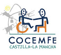

# LIFERAY EVP EN COCEMFECLM

---

# About me

- Manuel de la Peña
- Core software engineer en Liferay ESPAÑA
- Ingeniero Técnico Informático??
- Twitter: @mdelapenya

---

# About Liferay

- Central en Los Ángeles
- Centro de Ingeniería en Madrid
- 300 empleados
- Oficinas por todo el mundo
    - **Europa**: Alemania, España, Hungría, República Checa, Croacia, Serbia, Inglaterra
    - **Asia**: China, India, Malasia
    - **América**: Estados Unidos, Brasil, Canadá

---

# About Liferay

- Estructura organizativa socialmente concienciada
- Un mundo mejor es posible
- Liferay Foundation y EVP
    - Ayuda en la reconstrucción de casas por el terremoto de Haiti
    - Construcción de casas para familias pobres en Rojo Gomez (México)
    - Ayuda durante el desastre del huracán Katrina
    - Monitores de campamento en Santa Cruz (California)

---

# About Liferay

- **Enterprise**
- **Open Source**
- **For Life**

---

# About COCEMFECLM

- Personas con discapacidad física y orgánica
- Principio de **igualdad de oportunidades**.
- **Plena integración**, en el ámbito educativo, laboral y social
- Eliminar todo tipo de barreras

---

# Agenda

1. La Red como fuente de Información
2. La Nube
3. Redes Sociales Profesionales
4. Blogs
5. Taller

---

# 1 Información en la Red

- Buscando en La Red
    - Buscadores
- Intercambiando Información
    - Correo Electrónico
- Conectando con otros
    - Mensajería Instantánea
    - Redes Sociales

---

# 1.1 Buscadores

- Principales motores de búsqueda

---

# 1.1 Buscadores

- Técnicas de Búsqueda
    - El símbolo |
    - Las comillas
    - Eliminar palabras
    - Términos similares
    - Comodín
    - Rango de Números
    - Restringir búsquedas a un pais o dominio específico
    - Voy a tener suerte

    Fuente: <a target="_blank" href="http://www.tufuncion.com/ayuda-google">http://www.tufuncion.com/ayuda-google</a>

---

# 1.1 Buscadores

- Práctica:
    - Personaje de Interés: **Steve Jobs**
        - Características de Steve como persona
        - Inventos de Steve o de su compañía
    - Materia de Interés: **placas solares**
        - Características generales
        - Listado de fabricantes en España
        - Legislación vigente

---

# 1.2 E-mail

- Comunicación diferida
- Uno a uno
- Uno a muchos

---

# 1.2 E-mail

- Principales proveedores de e-mail

---

# 1.2 E-mail

- Práctica:
    - Creación de una cuenta de correo
    - You have an email!!
    - ¿Cuál nos gusta más?

---

# 1.3 Instant Messages

- Comunicación en tiempo real
- Uno a uno

---

# 1.3 Instant Messages

- Principales sistemas de mensajería instantánea

---

# 1.3 Instant Messages

- Práctica:
    - Vamos a chatear!

---

# 1.4 Redes Sociales

- Comunicación en tiempo real y/o diferido
- Uno a uno
- Uno a muchos
- Creación de redes

    

---

# 1.4 Redes Sociales

- Redes sociales más populares en **España**

---

# 1.4 Redes Sociales

- En el mundo:
    - Google+ (EE.UU)
    - Orkut (Brasil e India): es de Google
    - QZone (China)
    - VKontakte (Rusia)
    - Xing
    - **Linkedin**
    - Mixi (Japón)

---

# 1.4 Redes Sociales

- En cifras (20/03/2012):

---

# 2 ¿Estás en la nube?

---

# 2.1 La nube

- ¿Qué es?
- Un ejemplo claro
    - Correo Electrónico

---

# 2.2 La nube: cómo nos ayuda

- Beneficios
    - Reducción de costes
    - Agilidad
    - Escalabilidad

---

# 2.3 La nube: Colaborando

---

# 2.4 La nube: El caso Google

- Gmail
- Google Calendar
- Google Maps
- Google Talk
- Google Docs
    - Hojas de Cálculo
    - Documentos de texto enriquecido
    - Presentaciones y Diagramas

---

# 3 Redes Sociales

- **Twitter** : Qué es twitter
- **Linkedin** : Linkedin
- **Facebook Pages** : Facebooks pages

---

# 3.1 Twitter

---

# 3.2 Linkedin

---

# 3.3 Facebook Pages

---

# 4 Blogs

- Blogs 1
- Blogs 2
- Blogs 3

---

# 5 Taller

- Vamos a construir nuestro blog
- ¿Qué necesitamos?

---

# ¡¡Muchas Gracias!!

