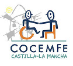

# ABOUT ME, LIFERAY AND COCEMFECLM

---

# About me

- Manuel de la Peña
- Core software engineer en Liferay ESPAÑA
- Ingeniero Técnico Informático??
- Apasionado de las nuevas tecnologías
- Twitter: **@mdelapenya**

---

# About Liferay
 
- Central en Los Ángeles
- Centro de Ingeniería en Madrid
- 300 empleados
- Oficinas por todo el mundo
    - **Europa**: Alemania, España, Hungría, República Checa, Croacia, Serbia, Inglaterra
    - **Asia**: China, India, Malasia
    - **América**: Estados Unidos, Brasil, Canadá

---

# About Liferay

- Estructura organizativa socialmente concienciada
- Un mundo mejor es posible
- **Liferay Foundation** y EVP
    - Ayuda en la reconstrucción de casas por el terremoto de Haiti
    - Construcción de casas para familias pobres en Rojo Gomez (México)
    - Ayuda durante el desastre del huracán Katrina
    - Monitores de campamento en Santa Cruz (California)
 - **ROG** (Return of Giving) mejor que ROI

---

# About Liferay

- **Enterprise**
- **Open Source**
- **For Life**

---

# About COCEMFECLM

- Personas con discapacidad física y orgánica
- Principio de **igualdad de oportunidades**.
- **Plena integración**, en el ámbito educativo, laboral y social
- Eliminar todo tipo de barreras

---

# Agenda

1. La Red como fuente de Información
2. La Nube
3. Redes Sociales Profesionales
4. Blogs
5. Taller

---

# Agenda

- 40 horas de voluntariado
- 07/05/2012 al 11/05/2012
- 9'30 a 14'30 -> **25 horas**
- Tutorías:
	- **15 horas**
		- 7 miércoles, de 6'30 a 8'30
- **#Aprendiendo #Liferay #COCEMFE**

---

# ¡¡Muchas Gracias!!

