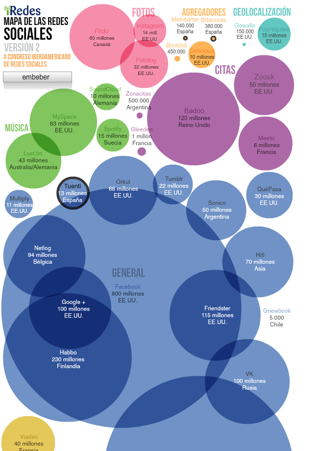

# 1. LA RED COMO FUENTE DE INFORMACIÓN

---

# Agenda

1. **La Red como fuente de Información**
2. La Nube
3. Redes Sociales Profesionales
4. Blogs
5. Taller

---

# 1 Información en la Red

- Buscando en La Red
    - Buscadores
- Intercambiando Información
    - Correo Electrónico
- Conectando con otros
    - Mensajería Instantánea
    - Redes Sociales

---

# Buscadores

- Principales motores de búsqueda

---

# Técnicas de Búsqueda

- El símbolo |
- Las comillas
- Eliminar palabras
- Términos similares
- Comodín
- Rango de Números
- Restringir búsquedas a un pais o dominio específico
- Voy a tener suerte

    Fuente: <a target="_blank" href="http://www.tufuncion.com/ayuda-google">http://www.tufuncion.com/ayuda-google</a>

---

# Práctica

- Personaje de Interés: **Steve Jobs**
    - Características de Steve como persona
    - Inventos de Steve o de su compañía
- Materia de Interés: **placas solares**
    - Características generales
    - Listado de fabricantes en España
    - Legislación vigente

---

# E-mail

- Comunicación diferida
- Uno a uno
- Uno a muchos

---

# Proveedores

---

# Práctica

- Creación de una cuenta de correo
- You have an email!!
- ¿Cuál nos gusta más?

---

# Instant Messages

- Comunicación en tiempo real
- Uno a uno

---

# Principales sistemas

---

# Práctica

- Vamos a chatear!

---

# Redes Sociales

- Comunicación en tiempo real y/o diferido
- Uno a uno
- Uno a muchos
- Creación de redes

    

---

# En España

---

# En el mundo

- En el mundo:
    - Google+ (EE.UU)
    - Orkut (Brasil e India): es de Google
    - QZone (China)
    - VKontakte (Rusia)
    - Xing
    - **Linkedin**
    - Mixi (Japón)

---

# En cifras (20/03/2012)

    

        
    

    

        <h3>Mapa de las Redes Sociales en el Mundo</h3>
        
        Fuente: <a target="_blank" href="http://www.abc.es/20120320/medios-redes/abci-mapa-redes-sociales-201203201824.html">ABC</a>
    

---

# Community Manager

- Nuevo dentro del Marketing, la Publicidad Online y la Biblioteconomía
- Profesión emergente.
- Generar contenidos atractivos.
- Convertir ser indispensable para los usuarios.
- Crear, analizar, entender y direccionar la información producida
- Monitorear acciones que se ejecutan
- Crear estrategias de comunicación digital

---

# ¡¡Muchas Gracias!!

