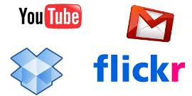

# 2. LA NUBE

---

# Agenda

1. La Red como fuente de Información
2. **La Nube**
3. Redes Sociales Profesionales
4. Blogs
5. Taller

---

# 2 ¿Estás en la nube?

---

# La nube

- ¿Qué es?
- Un ejemplo claro
    - Correo Electrónico

---

# Cómo beneficiarnos

- Reducción de costes
- Agilidad
- Escalabilidad

---

# Ejemplos en la nube

---

# El caso de Google

- Gmail
- Youtube
- Google Maps
- Google Talk
- Google Calendar
- Google Docs
    - Hojas de Cálculo
    - Documentos de texto
    - Presentaciones y Diagramas

---

# ¡¡Muchas Gracias!!

