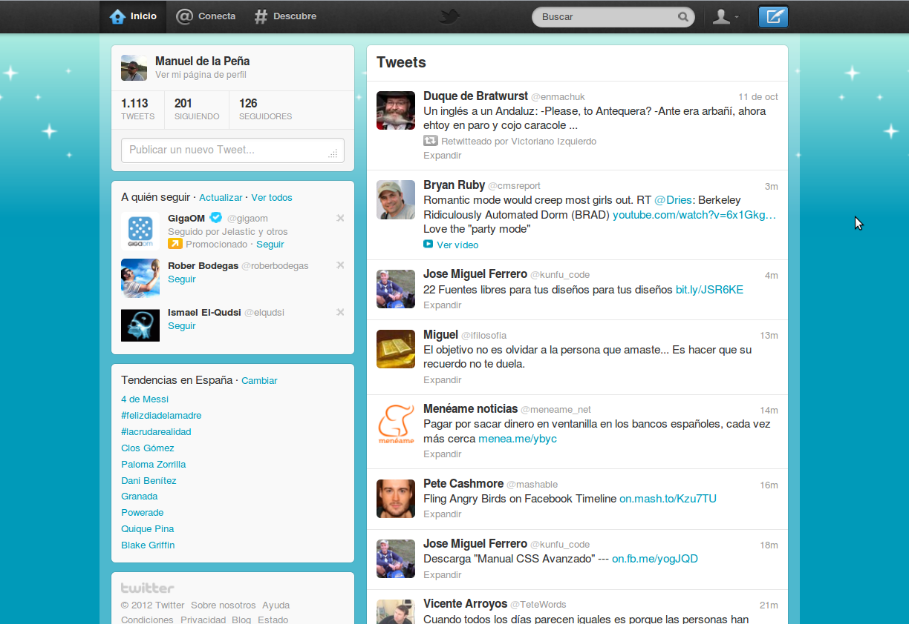
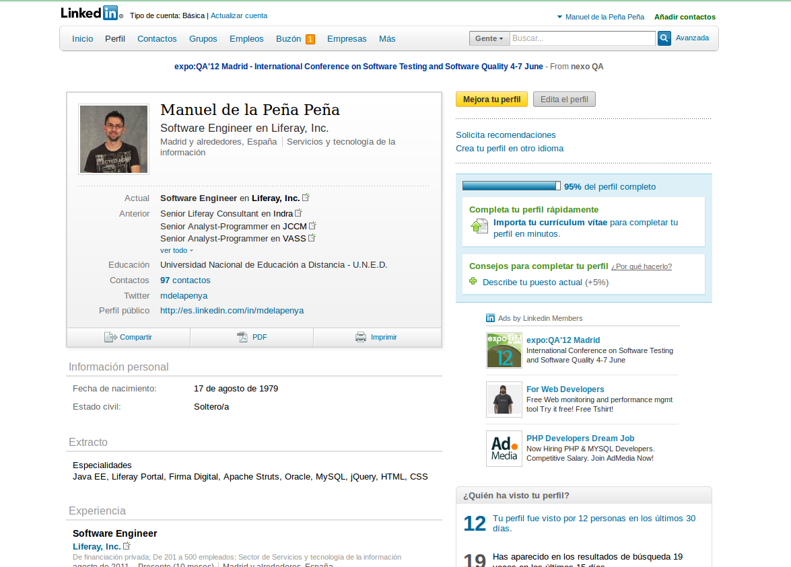
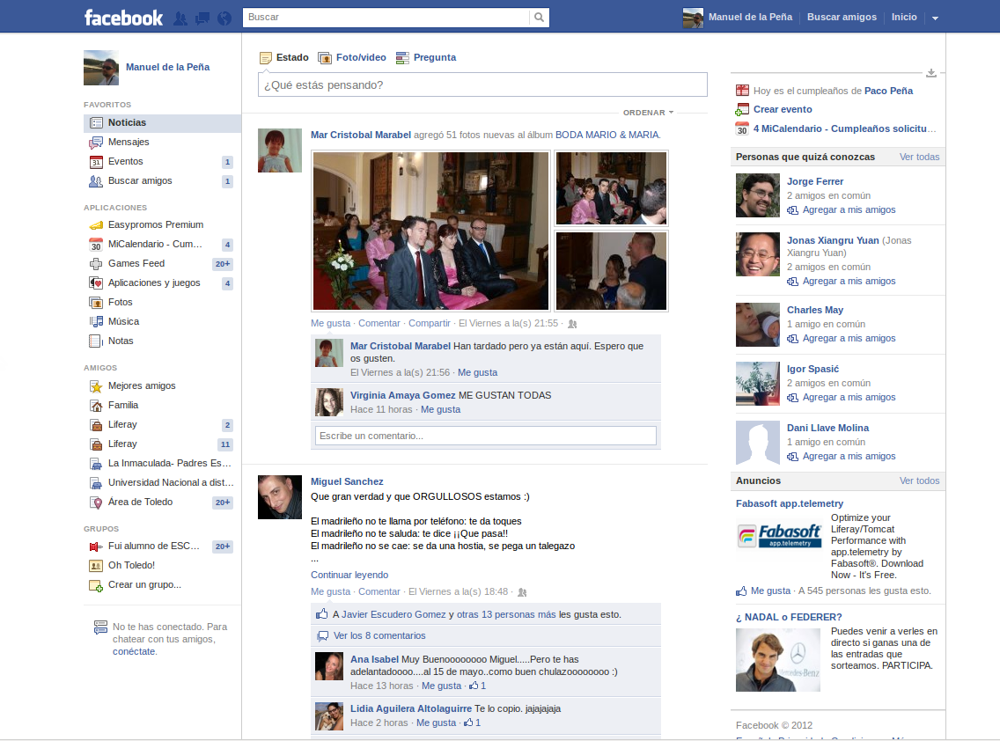

# 3. REDES SOCIALES PROFESIONALES

---

# Agenda

1. La Red como fuente de Información
2. La Nube
3. **Redes Sociales Profesionales**
4. Blogs
5. Taller

---

# ¿Cuáles son?

1. Twitter
2. Linkedin
3. Facebook

---

# Twitter

<a href="https://twitter.com" target="_blank">https://twitter.com</a>

---

# Twitter

- Microblogging
- Seguimiento en directo de acontecimientos
    - Terremoto de Tokio
    - Eventos deportivos
    - Programas de Televisión
    - Congresos y Charlas
- **Periodistas** somos tod@s
- Algun@s más y mejor que otros!!

---

# Twitter Basics

- Timeline
- Hashtag (#)
- Usuarios (@)
- Tweets y Retweets
- Menciones
- Following (A quién sigo)
- Followers (Seguidores)
- Mensajes Directos
- Trending Topic (TT)

    Fuente: 
    <a href="http://support.twitter.com/groups/31-twitter-basics/topics/104-welcome-to-twitter-support/articles/352810-el-glosario-de-twitter#" target="_blank">
        Twitter support
    </a>

---

# Timeline

- Cronología
- Una lista en tiempo real de los Tweets de las cuentas a quienes sigues. 
- Aparece en tu página de inicio de Twitter

---

# Hashtag (#)

- Etiquetas
- Tema en el que cualquier usuario puede hacer una aportación u opinión personal respecto a ese tema.
- Se usa el símbolo # ante las palabras relevantes de un Tweet para categorizarlos de forma más fácil en las búsquedas.
- Al hacer clic en un hashtag se muestran todos los otros Tweets en esa categoría
- Pueden colocarse en cualquier parte de tu Tweet
- Los hashtags que se vuelven muy populares, se convierten en TT

---

# Usuarios (@)

- El símbolo @ es usado para llamar nombres de usuario en los Tweets.
- Cuando un nombre de usuario es precedido por el símbolo @, se convierte en un enlace a su perfil de Twitter

---

# Tweets y Retweets

- Un Tweet...
    - sólo tiene 140 caracteres
    - puede marcarse como favorito.
- Un retweet...
    - Tweet de otro usuario, que fue re-publicado por alguien que conoces o a quien sigues
    - relanza las noticias a Twitter, compartiendo de nuevo información valiosa
    - RT al inicio de un Tweet: se trata de un Retweet

---

# Menciones

- Cuando otro usuario escribe tu nombre precedido del signo (@)
- Twitter notifica esta acción

---

# Following

- Seguir a alguien implica:
    - estar suscrito a sus Tweets como un Seguidor.
    - sus actualizaciones aparecerán en tu Timeline.
    - esa persona tiene permiso para enviarte Tweets privados, llamados mensajes directos

---

# Followers

- Los seguidores son personas que reciben tus Tweets.
- Si alguien te sigue, ellos:
    - se convierten en tus seguidores y se mostrarán en la sección de "nuevos seguidores".
    - reciben tus Tweets en su cronología principal, teléfono o cualquier aplicación de terceros que usen.
- Si sigues a alguien, eres su seguidor. 

---

# Mensajes Directos

- Mensajes privados entre quien lo envía y quien lo recibe.
- Los Tweets se convierten en DMs cuando comienzan con **"d nombredeusuario"** para especificar para quién es el mensaje.
- Quien recibe el DM puede borrar el mensaje, así como la persona que lo envía.

---

# Trending Topic (TT)

- Los hashtags que se vuelven muy populares, se convierten en Temas del Momento
- Twitter puede segmentar por países e incluso por regiones dentro de países
    - <a href="http://trendsmap.com" target="_blank">http://trendsmap.com</a>

---

# Otras

- URL cortas
    - Los acortadores de URLs se usan para cambiar URLs largos por unas versiones más cortas, y quepan en los tweets
- Servicios de acortadores
    - <a href="http://bitly.com" target="_blank">bitly.com</a>
    - <a href="http://t.co" target="_blank">t.co</a>
    - <a href="http://goo.gl" target="_blank">goo.gl</a>
    - <a href="http://tinyurl.com" target="_blank">TinyURL</a>

---

# Resumen

- Identificar a la fuente
- Aumentar la visibilidad
- Saber a quién llegar
- **A practicar!!**

---

# Linkedin

<a href="http://www.linkedin.com" target="_blank">www.linkedin.com</a>

---

# Linkedin Basics

- Red Social Profesional
- Currículum Vitae Profesional
    - Estudios
    - Experiencia
    - Conocimientos
    - Aptitudes
- Red de Contactos Profesionales
- Grupos de interés Profesional
- Recomendaciones
- Cazatalentos

---

# Linkedin

- Diferentes vistas del perfil

---

# Resumen

- CV
- Búsqueda de empleo directo
- ¿Tenéis un perfil?

---

# Facebook

<a href="http://www.facebook.com" target="_blank">www.facebook.com</a>

---

# Facebook Basics

- Contenidos
- Amigos
- Muro
- Páginas
- Me gusta
- Compartir
- Privacidad
- Otros

    Fuente: <a href="http://www.facebook.com/help/basics" target="_blank"/>Facebook Support</a>

---

# Facebook

---

# Contenidos

- **Elementos** que podemos utilizar: 
    - Fotos
    - Vídeos
    - Enlaces
    - Contenidos de otras aplicaciones. 

---

# Amigos

- **Destinatarios** de nuestras acciones:
    - Amigos individuales
    - Listas de amigos
- Acciones que podemos hacer:
    - Enviar solicitudes de amistad
    - Añadir, Eliminar y Bloquear
    - Etiquetado

---

# Muro

- Espacio para publicar y compartir con tus amigos.
- Compartir con un público amplio qué estás pensando: 
    - Actualizar tu estado y compartir contenidos. 
    - Publicaciones en tu perfil y también en la sección de noticias.
- Compartir con un pequeño grupo (familiares, tu equipo de fútbol o tu club de lectura)
- Compartir con un amigo.
    - Los amigos de tu amigo también podrán ver tu publicación. 
- Compartir algo en privado: **envía un mensaje privado** 

---

# Páginas

- Ayudan a los negocios, organizaciones y marcas a compartir su historia y conectar con el público.
- Si te gusta una página y quieres estar al tanto de sus actualizaciones y su actividad, haz clic en el botón "Me gusta". 
- Para crear una página: <a href="http://www.facebook.com/pages/create.php" target="_blank">http://www.facebook.com/pages/create.php</a>

    

---

# Me gusta

- Forma de hacer un comentario positivo
- Mostrar las cosas que más te importan en Facebook
- Forma simple de decirle a alguien que es de tu agrado, sin dejar un comentario
- En una página de Facebook, anuncio o un contenido de Facebook:
    - Establece una conexión.
    - Aparecerá una historia en tu Muro y puede que en Noticias.
- Ya no me gusta

---

# Compartir

- Etiqueta a las personas con quien estás:
    - Al añadir una etiqueta, al instante se crea un enlace al perfil de la persona y también se puede compartir tu publicación con sus amigos
- Di dónde estás
- Gestiona la privacidad desde donde publicas:
    - Selección de público objetivo, tanto cuando compartes el contenido como después

---

# Privacidad

- Elige con quién compartes cosas:
    - Público
    - Amigos (y amigos de cualquiera que esté etiquetado)
    - Solo yo
    - Personalizado
        - grupos específicos
        - listas de amigos o personas que hayas especificado para incluir o excluir 

---

# Otros

- Ofertas:
    - Descuentos a clientes en una página de Facebook.
    - Son como cupones y no cuesta nada crearlas.
- Aplicaciones
    - Mejorar la experiencia de usuario, 
    - Funciones útiles: eventos y calendario
    - Juegos Sociales. 

---

# Práctica

- 5 negocios que nos interesen.
    - ¿Tienen presencia en las redes sociales?
- ¿Nos gustan para que podamos crear conexiones?
- Buscar ofertas y/o cupones

---

# Debate

- ¿Cómo iniciaríamos nuestra estrategia de comunicación social?
- ¿Qué ventajas e inconvenientes tiene cada red?
- Formalidad Vs. Informalidad
- Público Objetivo

---

# ¡¡Muchas Gracias!!

