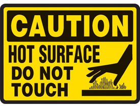
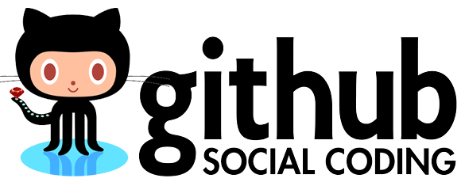
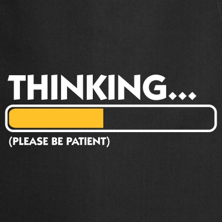
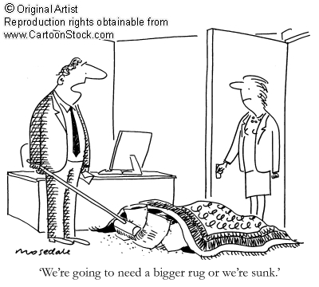
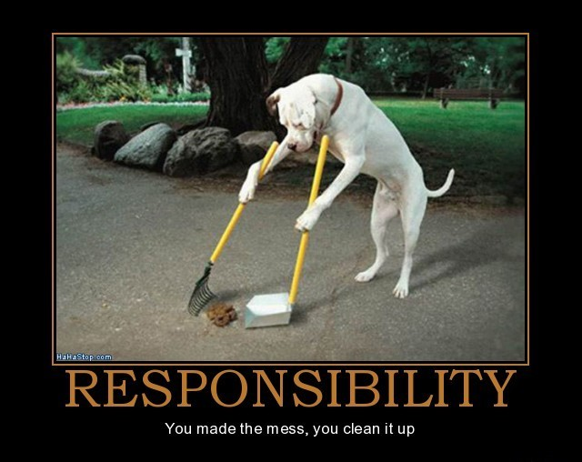
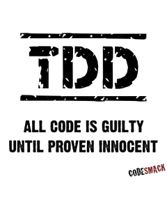

# CI ESSENTIAL PRACTICES

---

# About me

- Manuel de la Peña
- Software engineer en Liferay, Inc
- Ingeniero Técnico Informático
- Apasionado de las nuevas tecnologías
- Twitter: **@mdelapenya**

---

# Continuous Integration
 
- CI is a practice, not a tool, and requires a significant degree of discipline from the team as a whole.

---

# Continuous Integration

- The objective of our CI system is to ensure that our software is **working, in essence, all of the time**.

---

# Practice 1

---

# Don't check-in on a broken build

---

# Don't check in on a broken build

- Instead of checking in...
	- Responsible developers must wait to fix it:
		- They identify the cause of the breakage **as soon as possible** and fix it.
		- **Best position to work out** what caused the breakage and fix it inmediately.

---

# Don't check in on a broken build

- We don't want you to check-in further changes in a broken build. **Why??**

---

# Don't check in on a broken build (I)

- It will compound the failure with more problems.

---

# Don't check in on a broken build (II)

- It takes much long for the build to be fixed.

---

# Don't check in on a broken build (III)

- If we get used to seeing the build broken: Build stays broken all the time.

---

# Don't check in on a broken build (IV)

- The long term broken build is usually fixed by an Herculean effort of somebody on the team (**Miguel**), and the process starts again.

---

# Practice 2

---

# Always run test locally

---

# Always run test locally

- A commit triggers the creation of a **release candidate**.
- It is a way to ensure that **what we believe to work actually does**.
- What happens if someone checks in before your last update and the combination cause tests to fail?

---

# Always run test locally

- Before commiting:
	1. Refresh local copy of the project
	2. Initiate a local build and run the commit tests.
	3. Only when the build is successful is the developer ready to commit the changes.

## Jenkins shows the last build state: look it up!

---

# Always run tests locally

- Many tools to run test in a local machine:
	- ant test-integration, ant test-unit, ant test-class

---

# ...or send a pull request!!

	

		
	

	

		
		
		
		
		
	

	

		
	

---

# Practice 3

---

# Wait for Commit Tests to Pass

---

# Wait for Commit Tests to Pass

- The CI is a **shared resource** for the team.
- Developer who made the check-in is **responsible for monitoring the build's progress** (No lunch, no meetings)

---

# Wait for Commit Tests to Pass

- Aim: To find error and eliminate them ASAP, **without expecting perfection and zero errors**.
- Build breakages are a normal and expected part of the process.

---

# Wait for Commit Tests to Pass

- It's only **15-20 minutes**!!
- You can have a coffee
- Go to the bathroom
- Prepare your next action
- Organize the mail
- ...

---

# Practice 4

---

# Never go home on a broken build

---

# Never go home on a broken build

- If you broke the build on a Friday at 5'30...
	1. **Resign yourself** that you will be leaving late and try to fix it.
	2. **Revert your changes** and retry next week.
	3. Leave now and **leave the build broken**.

---

# Never go home on a broken build

- Check-in regularly and **EARLY** enough to give yourself time to deal with problems should they occur.
- Save your check-in for the next day

---

# Discipline on Distributed projects

---

# Discipline on Distributed projects

- Constant stream of changes committed to the version control system and a constant stream of new builds being triggered

---

# Discipline on Distributed projects

- If China breaks the build... then Europe day's work is dramatically affected
- If Europe goes home on a broken build... America would be screaming and crying.

---

# Discipline on Distributed projects

	

---

# Build Master

- Not only mantain the build but **also policed it**, ensuring that whoever broke the build was working to fix it.
- If not, the build engineer **would revert that check-in**.

---

# Practice 5

---

# Be prepared to Revert

	

---

# Reverting to previous revision

- We all make mistakes, so everyone will break the build from time to time.
- **Important!!** Get everything working again quickly.
	- If you can't fix the problem quickly, for whatever reason, you should revert to the previous change-set held in the version control and remedy it locally.
- You know that the previous version was good because **you don't check-in on a broken build!!!**

---

# Reverting to previous revision

	

---

# Practice 6

---

# Time-Box fixing before reverting

- Establish a rule: when the build breaks on check-in, try to fix it for **10 minutes**.
- If, after that, you aren't finished, **revert** to the previous version.

	

---

# Practice 7

---

# Don't Comment out Failing Tests

	

---

# Don't Comment out Failing Tests

- **Always the last resort**, very rarely and reluctant used.
- Has a regression been found?
	- **Fix the code!**
- Is one of the assumptions of the test no longer valid?
	- **Delete it!!**
- Has the application really changed the functionality under test for a valid reason?
	- **Modify the test!!**

---

# Practice 8

---

# Responsability for your breakages

	

---

# Responsability for your breakages

## Take responsability for all breakages that result from your changes

- If you commit a change and all the tests you wrote pass, but others break, the build is still broken
	- It's usually a Regression
	- Fix all the tests that are not passing as a result of your changes
- **Ask component leaders for collaboration!**

---

# Practice 9

---

# Test-Driven Development

	

---

# TDD

- Test suite is essential to CI
- Create tests when developing a new piece of functionality or fixing a bug:
	- Is an **executable specification of the expected behaviour** of the code to be written.
		- Application design
		- Regression tests
		- Documentation of the code

---

# Conclusions

---

# Conclusions

- Discipline
- Luke, use the tools!
- It's expected that everybody commits errors
- Wait for test to pass doing another productive task
- Don't be afraid of reverting
- Responsability

---