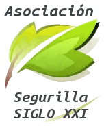

# ABOUT ME, LIFERAY AND COCEMFECLM

---

# About me

- Manuel de la Peña
- Core software engineer en Liferay ESPAÑA
- Ingeniero Técnico Informático
- Apasionado de las nuevas tecnologías
- Twitter: **@mdelapenya**

---

# About Liferay
 
- Central en Los Ángeles
- Centro de Ingeniería en Madrid
- 300 empleados
- Oficinas por todo el mundo
    - **Europa**: Alemania, España, Hungría, República Checa, Croacia, Serbia, Inglaterra
    - **Asia**: China, India, Malasia
    - **América**: Estados Unidos, Brasil, Canadá

---

# About Liferay

- Estructura organizativa socialmente concienciada
- Un mundo mejor es posible
- **Liferay Foundation** y EVP
    - Ayuda en la reconstrucción de casas por el terremoto de Haiti
    - Construcción de casas para familias pobres en Rojo Gomez (México)
    - Ayuda durante el desastre del huracán Katrina
    - Monitores de campamento en Santa Cruz (California)
    - **Promoción del autoempleo TIC a mujeres con discapacidad en Toledo**
 - **ROG** (Return of Giving) mejor que ROI

---

# About Liferay

- **Enterprise**
- **Open Source**
- **For Life**

---

# About Segurilla s.XXI

- Promover y fomentar la conciencia comunitaria.
- Promover y participar en campañas de solidaridad y ayuda hacia los sectores más desfavorecidos.
- Reivindicar el derecho de todos los ciudadanos de participar activamente en la creación y consecución de una sociedad igualitaria.

---

# Agenda

1. ¿Qué es el software libre?
2. ¿Por qué es sostenible?
3. ¿Cómo podemos utilizar software libre?
4. Aún más... El Movimiento Open Source
5. Otras iniciativas de código abierto

---

# ¡¡Muchas Gracias!!

