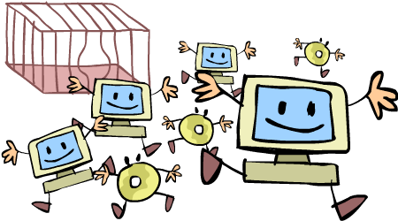
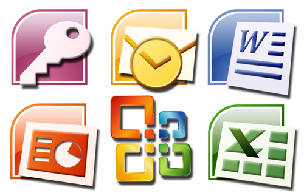
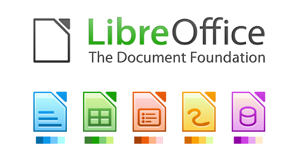
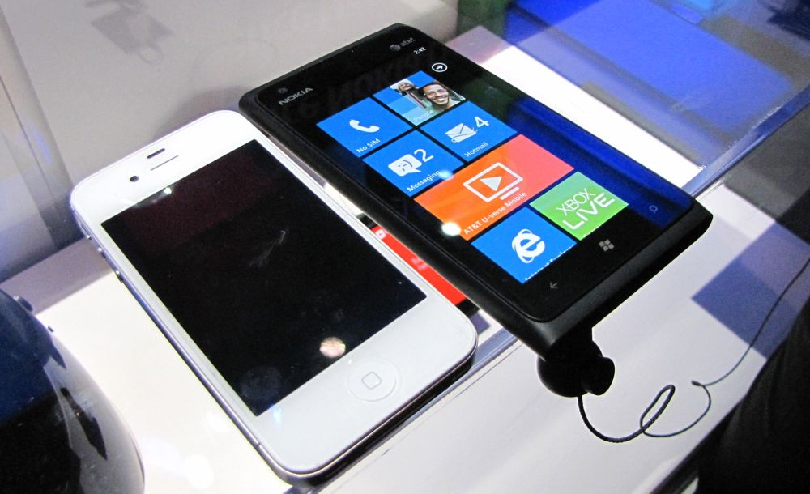
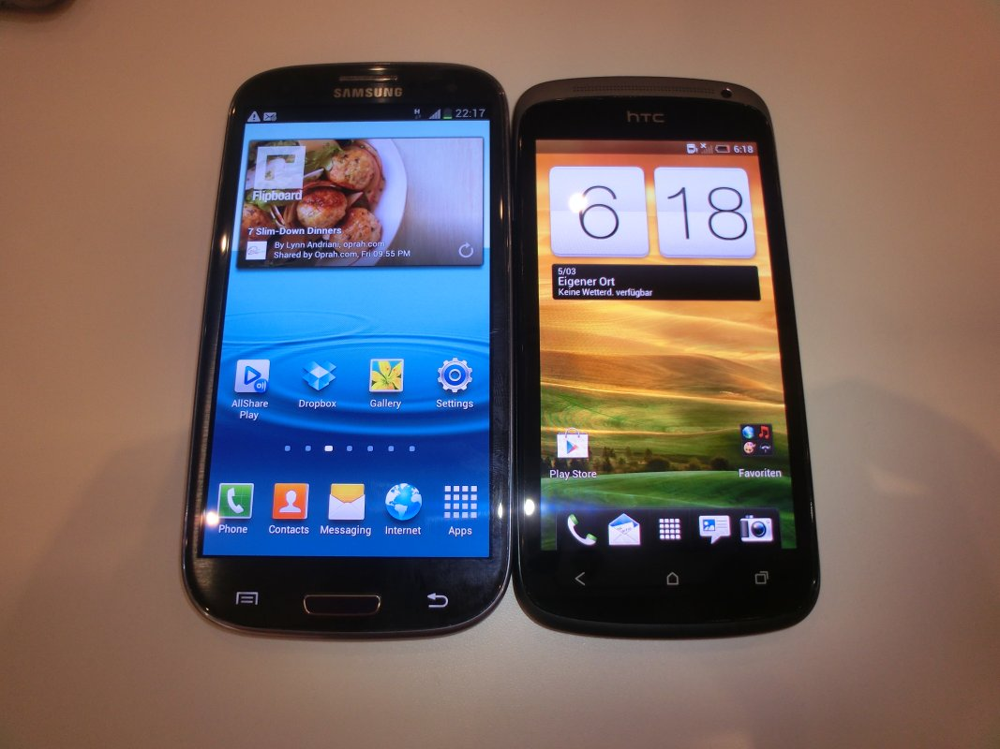
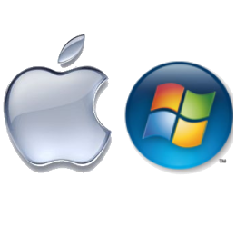
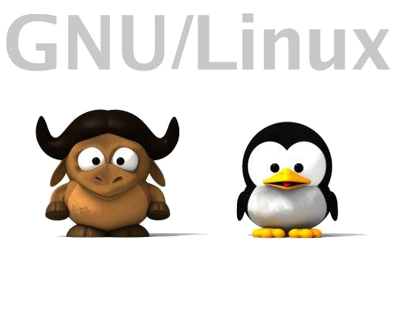

# DESARROLLO SOSTENIBLE Y TECNOLOGÍA: El software libre

---

# Agenda

0. **About**
1. Desarrollo sostenible y Tecnología
2. Software Libre
3. ¿Es todo tan bonito?
4. Inconvenientes
5. Ejemplos de Software Libre
6. Open Source no es sólo software

---

# About...

	

		
	

	

		
	

---

# About me

- Manuel de la Peña
- Software engineer en Liferay, Inc.
- Ingeniero Técnico Informático
- Apasionado de las tecnologías
- Twitter: **@mdelapenya**

---

# About Liferay
 
- Central en Los Ángeles
- Centro de Ingeniería en Madrid
- +300 empleados
- Oficinas por todo el mundo
    - **Europa**: Alemania, España, Hungría, República Checa, Croacia, Serbia, Inglaterra
    - **Asia**: China, India, Malasia
    - **América**: Estados Unidos, Brasil, Canadá

---

# About Liferay

- Estructura organizativa socialmente concienciada
- Un mundo mejor es posible
- **Liferay Foundation** y EVP
    - Ayuda en la reconstrucción de casas por el terremoto de Haiti
    - Construcción de casas para familias pobres en Rojo Gomez (México)
    - Ayuda durante el desastre del huracán Katrina
    - **Promoción del autoempleo TIC a mujeres con discapacidad en Toledo**
 - **ROG** (Return of Giving) mejor que ROI

---

# About Liferay

- **Enterprise**
- **Open Source**
- **For Life**

---

# About Segurilla s.XXI

- Promover y fomentar la conciencia **comunitaria**.
- Promover y participar en campañas de **solidaridad** y ayuda hacia los sectores más desfavorecidos.
- Reivindicar el derecho de tod@s l@s ciudadan@s de participar activamente en la creación y consecución de una **sociedad igualitaria**.

---

# Agenda

0. About me
1. Desarrollo sostenible y Tecnología
2. Software Libre
3. ¿Es todo tan bonito?
4. Beneficios de utilizar Software Libre
5. Ejemplos de Software Libre
6. Open Source no es sólo software

---

# Desarrollo sostenible

---

# Desarrollo sostenible

- **Sostenibilidad económica**: la actividad es financieramente posible y rentable.
- **Sostenibilidad social**: Se basa en la cohesión social y en la habilidad para trabajar en la persecución de objetivos comunes.
- **Sostenibilidad ambiental**: Compatibilidad entre la actividad considerada y la preservación de la biodiversidad y de los ecosistemas, evitando la degradación de las funciones fuente y sumidero.

---

# Software Libre

---

# Software Libre

- Las 4 libertades:
	- **Libertad para usar** el programa para cualquier propósito y sin restricciones
	- Libertad para estudiar cómo funciona el programa y **adaptarlo a tus necesidades**, para lo que es necesario disponer del código fuente.
	- Libertad para **distribuir copias**.
	- Libertad para **mejorar el programa** y distribuir copias.

---

# Beneficios

- **Independencia** del fabricante de software
- **Ahorro** de costes
- Mayor **seguridad y calidad** del software
- Desarrollo del sector TIC **local**
- Generación de valor en **comunidad**
- **¡¡Ventajas objetivas!!**

Elemento clave en la mejora de los S.I. de empresas y AA.PP. Recomendado por la UE mediante varias normativas en últimos años.

---

# Independencia

- **Lock-in**: Las AA.PP. y las empresas usuarias pueden controlar el uso de la tecnología y tienen más libertad para diseñar su **estrategia tecnológica futura**.

---

# Ahorro de costes

- Compartición y Reutilización
- **Ausencia de costes asociados a las licencias**
- Software **100% legal** siempre.

---

# Seguridad y Calidad

- **Hacer público el código**
	- Aportaciones de la **Comunidad de Desarrolladores** 
	- Corrige errores detectados
	- **Evoluciona más rápido** la aplicación.

---

# Desarrollo del sector TIC local

- **Acceso al código**
	- **PYMES locales**, AA.PP., Empresas
	- **Competición en mejores condiciones** con operadores dominantes.

---

# Generación de valor en comunidad

- Colaboración: **compartir y reutilizar aplicaciones**
	- AA.PP. y Empresas, el sector tecnológico y la Comunidad de Desarrolladores.

---

# Poniendo todo junto...

---

# Sostenibilidad económica
	
- ¿Adquisición y renovación de licencias?: **Nooo!!!**
- Copia de aplicaciones: **Legal** en tantos equipos como necesite.
- Competencia sana entre proveedores: **Abaratamiento** de los costes.

---

# Sostenibilidad social

- Compartición y reutilización de aplicaciones
- Colaboración entre sector tecnológico y desarrolladores

---

# Sostenibilidad ambiental

- Tiene una menor necesidad de hardware:
	- Equipos más baratos
	- Vida útil mayor.
- Aumenta la diversidad de productos al alcance del usuario
	- Aumenta la oferta.

---

# ¿Es todo tan bonito?

---

# Inconvenientes

- **Escasa difusión**: pocas personas, lo que desmotiva su uso
- Inherente **resistencia al cambio**
- **Posición dominante** del software privativo
- Menor compatibilidad con el **hardware**.
- Algunas aplicaciones (bajo Linux) pueden llegar a ser algo complicadas de instalar.
- Dificultad en el **intercambio de archivos**

---

# Más inconvenientes

- Poca estabilidad y flexibilidad en el campo de **multimedia y juegos**.
- Inexistencia de **garantía** por parte del autor
- Pocos profesionales en el mercado con **conocimientos sólidos** en software libre
- Pocos técnicos y expertos suficientemente.
- Servicios de soporte en general escasos y más caros

---

# Ejemplos de Software Libre

- **Microsoft Office** 

---

# Ejemplos de Software Libre

- Microsoft Office -> **Libre Office**

---

# Ejemplos de Software Libre

- Microsoft Office -> Libre Office
- **Photoshop**

---

# Ejemplos de Software Libre

- Microsoft Office -> Libre Office
- Photoshop -> **The Gimp**

---

# Ejemplos de Software Libre

- Microsoft Office -> Libre Office
- Photoshop -> The Gimp
- **Windows Phone, iOS**

	

		
	

	

		
	

---

# Ejemplos de Software Libre

- Libre Office -> Microsoft Office
- The Gimp -> Photoshop
- Windows Phone, iOS -> **Android**

	

		
	

	

		
	

---

# Ejemplos de Software Libre

- Libre Office -> Microsoft Office
- The Gimp -> Photoshop
- Android -> Windows Phone, iOS
- **MS Windows, MAC OSX**

---

# Ejemplos de Software Libre

- Libre Office -> Microsoft Office
- The Gimp -> Photoshop
- Android -> Windows Phone, iOS
- MS Windows, MAC OSX -> **GNU/Linux** 

---

# Opensource no es sólo software

---

# Opensource no es sólo software

- Open Hardware
	- **Arduino**
	- **Raspberry Pi**
- GVCS: Maquinaria Open Source
- **y cada vez más!!**

---

# Arduino

<iframe width="100%" height="80%" src="http://www.youtube.com/embed/UoBUXOOdLXY" frameborder="0" allowfullscreen></iframe>

---

# Global Village Construction Set

<iframe width="100%" height="80%" src="http://opensourceecology.org/gvcs.php" frameborder="0" allowfullscreen></iframe>

---

# Raspberry Pi

- Computador del tamaño de una tarjeta de crédito
- Hojas de cálculo, procesadores de texto, juegos, Video de alta definición, etc.
- Ideal para aprender a programar (niños especialmente)
- **$25 o $35**

	

		
	

	

		 
	

---

# Conclusiones...

- **Escasa difusión** -> los vendendores de software privativo afianzan su posición dominante
- Los usuarios **no son personas aisladas** que consumen sistemas y aplicaciones informáticas y guardan sus trucos o recetas en casa.
	- Argumentaciones de abogados
	- Recetas de cocina
- El enfoque del Software de Libre nos lleva a trabajar todos juntos en un **intercambio permanente, legal y libre** de las mejoras.
- Todo el mundo se aprovecha de las mejoras, **¡incluso quienes fabrican el software!**

---

# ... más conclusiones

- Es un **principio global**, la unión hace la fuerza: si los usuarios pueden leer, modificar y redistribuir el código fuente de un programa, éste va a evolucionar, va a desarrollarse y va a mejorar a una velocidad vertiginosa.
- Los códigos públicos permiten adaptarnos a ellos, **sin dependencias** de grandes empresas que en algún momento dado puedan modificarlos y/o retirarlos del mercado, dejándonos **fuera de juego**.

---

# ... ya termino!

- El Sofware Libre está ahí a nuestro alcance:
	- Coches
	- Electrodomésticos
	- Aviación
	- Radares

---

# Enlaces de interés

- Cenatic
	- http://www.cenatic.es/publicaciones/divulgativas

---

# Imágenes

		- Red global verde: http://es.fotolia.com/id/28659625
		- Sostenibilidad Económica: http://www.nextel.es/wp-content/uploads/rse_economica-300x200.jpg
		- Cerditos: http://es.fotolia.com/id/39682380
		- Colaboración: http://es.fotolia.com/id/37122502
		- Entorno local: http://es.fotolia.com/id/35289929
		- Manos: http://es.fotolia.com/id/40320218
		- Hormigonera: http://es.fotolia.com/id/40517520
		- Huella ecológica: http://es.fotolia.com/id/14429480
		- Interrogantes: http://es.fotolia.com/id/37148107
		- CD's: http://es.fotolia.com/id/20037990
		- Business Ethics: http://es.fotolia.com/id/41066691
		- Puertas Abiertas: http://es.fotolia.com/id/36773330

---

# ¡¡Muchas Gracias!!

---

# ¿Preguntas, Dudas, Sugerencias?

