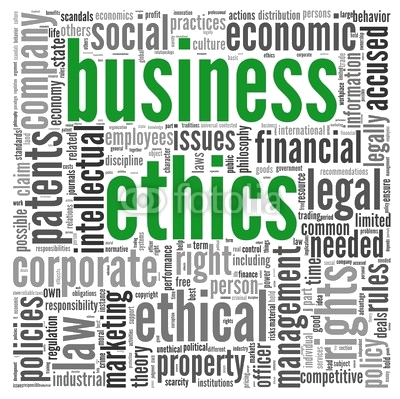

# DESARROLLO SOSTENIBLE Y TECNOLOGÍA: El software libre

---

# Agenda

0. **About**
1. Desarrollo sostenible y Tecnología
2. Software Libre
3. ¿Es todo tan bonito?
4. Beneficios de utilizar Software Libre
5. Ejemplos de Software Libre
6. Open Source no es sólo software

---

# About...

	

		
	

	

		
	

---

# About me

- Manuel de la Peña
- Software engineer en Liferay, Inc.
- Ingeniero Técnico Informático
- Apasionado de las nuevas tecnologías
- Twitter: **@mdelapenya**

---

# About Liferay
 
- Central en Los Ángeles
- Centro de Ingeniería en Madrid
- +300 empleados
- Oficinas por todo el mundo
    - **Europa**: Alemania, España, Hungría, República Checa, Croacia, Serbia, Inglaterra
    - **Asia**: China, India, Malasia
    - **América**: Estados Unidos, Brasil, Canadá

---

# About Liferay

- Estructura organizativa socialmente concienciada
- Un mundo mejor es posible
- **Liferay Foundation** y EVP
    - Ayuda en la reconstrucción de casas por el terremoto de Haiti
    - Construcción de casas para familias pobres en Rojo Gomez (México)
    - Ayuda durante el desastre del huracán Katrina
    - **Promoción del autoempleo TIC a mujeres con discapacidad en Toledo**
 - **ROG** (Return of Giving) mejor que ROI

---

# About Liferay

- **Enterprise**
- **Open Source**
- **For Life**

---

# About Segurilla s.XXI

- Promover y fomentar la conciencia **comunitaria**.
- Promover y participar en campañas de **solidaridad** y ayuda hacia los sectores más desfavorecidos.
- Reivindicar el derecho de tod@s l@s ciudadan@s de participar activamente en la creación y consecución de una **sociedad igualitaria**.

---

# Agenda

0. About me
1. **Desarrollo sostenible y Tecnología**
2. Software Libre
3. ¿Es todo tan bonito?
4. Beneficios de utilizar Software Libre
5. Ejemplos de Software Libre
6. Open Source no es sólo software

---

# Desarrollo sostenible

- **Sostenibilidad económica**: la actividad es financieramente posible y rentable.
- **Sostenibilidad social**: Se basa en la cohesión social y en la habilidad para trabajar en la persecución de objetivos comunes.
- **Sostenibilidad ambiental**: Compatibilidad entre la actividad considerada y la preservación de la biodiversidad y de los ecosistemas, evitando la degradación de las funciones fuente y sumidero.

---

# Software Libre

- **Libertad para usar** el programa para cualquier propósito y sin restricciones
- Libertad para estudiar cómo funciona el programa y **adaptarlo a tus necesidades**, para lo que es necesario disponer del código fuente.
- Libertad para **distribuir copias**.
- Libertad para **mejorar el programa** y distribuir copias.

---

# Software Libre

- Elemento clave en la mejora de los S.I. de empresas y AA.PP.
- Recomendado por la UE mediante varias normativas en últimos años.
- **Independencia** del fabricante de software
- **Ahorro** de costes
- Mayor **seguridad y calidad** del software
- Desarrollo del sector TIC **local**
- Generación de valor en **comunidad**
- **¡¡Ventajas objetivas!!**

---

# Independencia

Las AA.PP. y las empresas usuarias pueden controlar el uso de la tecnología y tienen más libertad para diseñar su **estrategia tecnológica futura**.

---

# Ahorro de costes

Gracias a la compartición, la reutilización y la **ausencia de costes asociados a las licencias**, se genera un ahorro significativo en el coste final de las aplicaciones, utilizando siempre un software **100% legal**.

---

# Seguridad y Calidad

**Hacer público el código** permite aportaciones de la **Comunidad de Desarrolladores** que contribuye de forma continua a la seguridad y la calidad del software, corrigiendo los errores detectados y haciendo **evolucionar más rápido** la aplicación.

---

# Desarrollo del sector TIC local

Al tener **acceso al código**, las **PYMES del entorno** pueden ofrecer servicios a la AA.PP. y Empresas, pudiendo **competir en mejores condiciones** con otros operadores dominantes en el sector.

---

# Generación de valor en comunidad

Usar software libre permite a las AA.PP. y las empresas **compartir y reutilizar aplicaciones**, colaborando entre sí, con el sector tecnológico y con la Comunidad de Desarrolladores.

---

# Poniendo todo junto...

---

# Sostenibilidad económica
	
- Adquisición y renovación de licencias.
- Copia de aplicaciones de forma legal en tantos equipos como necesite.
- Mayor competencia de proveedores => abaratamiento de los costes.

---

# Sostenibilidad social

**Ej:** Consecuencias sociales en una empresa, en todos los niveles:

	- los trabajadores (condiciones de trabajo, nivel salarial, etc.)
	- los proveedores
	- los clientes
	- las comunidades locales y
	- la sociedad en general

---

# Sostenibilidad y Software Libre

- **Sostenibilidad ambiental**: Compatibilidad entre la actividad considerada y la preservación de la biodiversidad y de los ecosistemas, evitando la degradación de las funciones fuente y sumidero.

	- Tiene una menor necesidad de hardware:
		- Equipos más baratos
		- Vida útil mayor.
	- Aumenta la diversidad de productos al alcance del usuario
		- Aumenta la oferta.

---

# ¿Es todo tan bonito?

---

# Inconvenientes

- No se encuentra aún suficientemente difundido: pocas personas, lo que desmotiva su uso
- Pocos técnicos y expertos suficientemente. Servicios de soporte en general escasos y más caros
- Pocos profesionales en el mercado con conocimientos sólidos en software libre
- Inherente **resistencia al cambio**
- **Posición dominante** del software privativo
- Algunas aplicaciones (bajo Linux) pueden llegar a ser algo complicadas de instalar.
- Inexistencia de garantía por parte del autor
- Poca estabilidad y flexibilidad en el campo de multimedia y juegos.
- Menor compatibilidad con el hardware.
- Dificultad en el **intercambio de archivos**

---

# Conclusiones

- Los usuarios no son personas aisladas que consumen sistemas y aplicaciones informáticas y guardan sus trucos o recetas en casa.
- El enfoque del Software de Fuentes Abiertas nos lleva a trabajar todos juntos en un **intercambio permanente, legal y libre** de las mejoras.
- Todos nos aprovechamos de las mejoras de todos, incluso quienes fabrican el software.

---

# Conclusiones

- Es un **principio global**, la unión hace la fuerza: si los usuarios pueden leer, modificar y redistribuir el código fuente de un programa, éste va a evolucionar, va a desarrollarse y va a mejorar a una velocidad vertiginosa.
- Los códigos públicos permiten adaptarnos a ellos, sin dependencias de grandes empresas que en algún momento dado puedan modificarlos y/o retirarlos del mercado, dejándonos fuera de juego.

---

# Enlaces de interés

- Cenatic
	- http://www.cenatic.es/publicaciones/divulgativas

---

# Imágenes

		- Red global verde: **http://es.fotolia.com/id/28659625**
		- Cerditos: **http://es.fotolia.com/id/39682380**
		- Colaboración: **http://es.fotolia.com/id/37122502**
		- Entorno local: **http://es.fotolia.com/id/35289929**
		- Manos: **http://es.fotolia.com/id/40320218**
		- Hormigonera: **http://es.fotolia.com/id/40517520**
		- Interrogantes: **http://es.fotolia.com/id/37148107**
		- CD's: **http://es.fotolia.com/id/11192371**
		- Business Ethics: **http://es.fotolia.com/id/41066691**

---

# ¡¡Muchas Gracias!!

---

# ¿Preguntas?

Turno de dudas, preguntas, sugerencias...