# DESARROLLO SOSTENIBLE Y TECNOLOGÍA: El software libre

---

# About me

- Manuel de la Peña
- Software engineer en Liferay, Inc.
- Ingeniero Técnico Informático
- Apasionado de las tecnologías
- Twitter: **@mdelapenya**

---

# About Liferay
 
- Central en Los Ángeles
- Centro de Ingeniería en Madrid
- +350 empleados
- Oficinas por todo el mundo
    - **Europa**: Alemania, España, Hungría, República Checa, Croacia, Serbia, Inglaterra, Francia, Holanda
    - **Asia**: China, India, Malasia
    - **América**: Estados Unidos, Brasil, Canadá

---

# About Liferay

- Estructura organizativa socialmente concienciada
- Un mundo mejor es posible
- **Liferay Foundation** y EVP
    - Ayuda en la reconstrucción de casas por el terremoto de Haiti
    - Construcción de casas para familias pobres en Rojo Gomez (México)
    - Ayuda durante el desastre del huracán Katrina
    - **Promoción del autoempleo TIC a mujeres con discapacidad en Toledo**
 - **ROG** (Return of Giving) mejor que ROI

---

# About Liferay

- **Enterprise**
- **Open Source**
- **For Life**

---

# About Segurilla s.XXI

- Promover y fomentar la conciencia **comunitaria**.
- Promover y participar en campañas de **solidaridad** y ayuda hacia los sectores más desfavorecidos.
- Reivindicar el derecho de tod@s l@s ciudadan@s de participar activamente en la creación y consecución de una **sociedad igualitaria**.

---

# Agenda

0. About me
1. Desarrollo sostenible y Tecnología
2. Software Libre
3. ¿Es todo tan bonito?
4. Beneficios de utilizar Software Libre
5. ¿Cómo me afecta a mí?
6. Lo que habitualmente no sabemos
7. Open Source no es sólo software

---

# Desarrollo sostenible

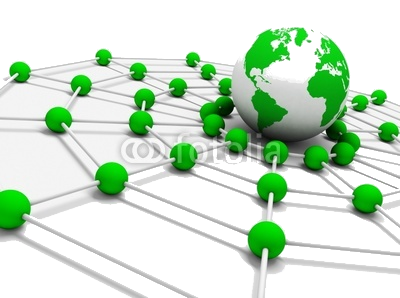

---

# Desarrollo sostenible

- **Sostenibilidad económica**: la actividad es financieramente posible y rentable.

---

# Desarrollo sostenible

- **Sostenibilidad económica**: la actividad es financieramente posible y rentable.
- **Sostenibilidad social**: Se basa en la cohesión social y en la habilidad para trabajar en la persecución de objetivos comunes.

---

# Desarrollo sostenible

- **Sostenibilidad económica**: la actividad es financieramente posible y rentable.
- **Sostenibilidad social**: Se basa en la cohesión social y en la habilidad para trabajar en la persecución de objetivos comunes.
- **Sostenibilidad ambiental**: Compatibilidad entre la actividad considerada y la preservación de la biodiversidad y de los ecosistemas, evitando la degradación de las funciones fuente y sumidero.

---

# Software Libre

---

# Las 4 Libertades

- **Libertad 0**: **Libertad para que uses** el programa para cualquier propósito y sin restricciones

---

# Las 4 Libertades

- **Libertad 0**: **Libertad para que uses** el programa para cualquier propósito y sin restricciones
- **Libertad 1**: Libertad para que estudies cómo funciona el programa y **adaptarlo a tus necesidades**, para lo que es necesario disponer del código fuente.

---

# Las 4 Libertades

- **Libertad 0**: **Libertad para que uses** el programa para cualquier propósito y sin restricciones
- **Libertad 1**: Libertad para que estudies cómo funciona el programa y **adaptarlo a tus necesidades**, para lo que es necesario disponer del código fuente.
- **Libertad 2**: Libertad para **que distribuyas copias**.

---

# Las 4 Libertades

- **Libertad 0**: **Libertad para que uses** el programa para cualquier propósito y sin restricciones
- **Libertad 1**: Libertad para que estudies cómo funciona el programa y **adaptarlo a tus necesidades**, para lo que es necesario disponer del código fuente.
- **Libertad 2**: Libertad para **que distribuyas copias**.
- **Libertad 3**: Libertad para **que mejores el programa** y distribuyas copias.

---

# Beneficios

- **Independencia** del fabricante de software
- **Ahorro** de costes
- Mayor **seguridad y calidad** del software
- **Desarrollo** del sector TIC **local**
- Generación de valor en **comunidad**

Elemento clave en la mejora de los S.I. de empresas y AA.PP. Recomendado por la UE mediante varias normativas en últimos años.

---

# Independencia

- **Lock-in**: Las AA.PP. y las empresas usuarias pueden controlar el uso de la tecnología y tienen más libertad para diseñar su **estrategia tecnológica futura**.
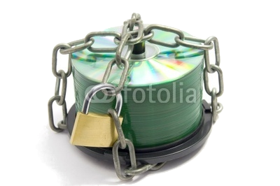

---

# Ahorro de costes

- Compartición y Reutilización
- **Ausencia de costes asociados a las licencias**
- Software **100% legal** siempre.

---

# Seguridad y Calidad

- **Hacer público el código**
	- Aportaciones de la **Comunidad de Desarrolladores** 
	- Corrige errores detectados
	- **Evoluciona más rápido** la aplicación.

---

# Desarrollo del sector TIC local

- **Acceso al código**
	- **PYMES locales**, AA.PP., Empresas
	- **Competición en mejores condiciones** con operadores dominantes.

---

# Generación de valor en comunidad

- Colaboración: **compartir y reutilizar aplicaciones**
	- AA.PP. y Empresas, el sector tecnológico y la Comunidad de Desarrolladores.

---

# ¿Ventajas Objetivas?

- **¡¡Ventajas objetivas!!**

---

# Poniendo todo junto...

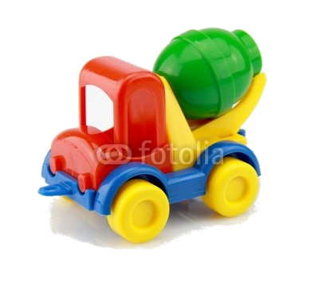

---

# Sostenibilidad económica
	
- ¿Adquisición y renovación de licencias?: **Nooo!!!**
- Copia de aplicaciones: **Legal** en tantos equipos como necesite.
- Competencia sana entre proveedores: **Abaratamiento** de los costes.

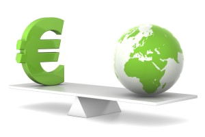

---

# Sostenibilidad social

- Compartición y reutilización aplicaciones
- El sector tecnológico colabora con los desarrolladores
- **Configura y es configurado por la sociedad**

---

# Sostenibilidad ambiental

- Tiene una menor necesidad de hardware:
	- Equipos más baratos
	- Vida útil mayor.

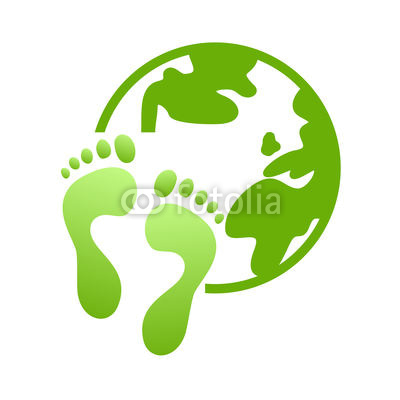

---

# ¿Es todo tan bonito?

---

# Inconvenientes

- **Escasa difusión**: pocas personas, lo que desmotiva su uso
- Inherente **resistencia al cambio**
- **Posición dominante** del software privativo
- Menor compatibilidad con el **hardware**.
- Algunas aplicaciones (bajo Linux) pueden llegar a ser algo complicadas de instalar.
- Dificultad en el **intercambio de archivos**

---

# Más inconvenientes

- Poca estabilidad y flexibilidad en el campo de **multimedia y juegos**.
- Inexistencia de **garantía** por parte del autor
- Pocos profesionales en el mercado con **conocimientos sólidos** en software libre
- Pocos técnicos y expertos suficientemente.
- Servicios de soporte en general escasos y más caros

---

# ¿Cómo me afecta a mí?

---

# Ofimática

- **Microsoft Office** 

---

# Ofimática

- Microsoft Office -> **Libre Office**

---

# Navegadores

- **Internet Explorer** 

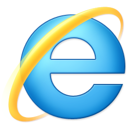

---

# Navegadores

- Internet Explorer -> **Google Chrome**, **Mozilla Firefox**, **Ópera**

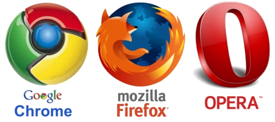

---

# Retoque de imágenes 

- **Photoshop**

---

# Retoque de imágenes

- Photoshop -> **The Gimp**

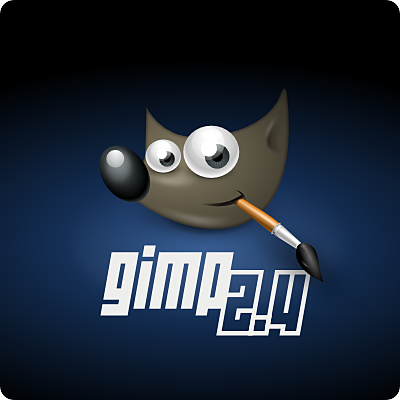

---

# Movilidad

- **Windows Phone, iOS**

	

		
	

	

		
	

---

# Movilidad

- Windows Phone, iOS -> **Android**

	

		
	

	

		
	

---

# Sistemas Operativos

- **MS Windows, MAC OSX**

---

# Sistemas Operativos

- MS Windows, MAC OSX -> **GNU/Linux** 

---

# Cifras que a menudo no sabemos

 

---

# Windows XP

- Lanzado al mercado el 25 de octubre de 2001
- En agosto de 2012: **46'33% de cuota de mercado**
- Home Edition Castellano CD Microsoft: **236,73€**
- Office XP Win32 Castellano: **418,94€**

---

# Windows 7

- Lanzado al mercado el 22 de octubre de 2009
- En agosto de 2012: **46,60% de cuota de mercado**
- Windows 7 Home Premium: **$119.99** / **$199.99**
- Windows 7 Professional: **$199.99** / **$299.99**
- Windows 7 Ultimate: **$219.99** / **$319.99**

Fuente (2009): http://www.genbeta.com/windows/el-precio-de-windows-7

---

# Windows 8 Pro

- Lanzado al mercado el 26 de octubre de 2012
- **29'99€** hasta diciembre de 2012, luego **59'99€**.
- Disponer del S.O. Windows XP SP3, Windows Vista o Windows 7.

---

# Comprando un portátil

- **Notebook:** Entre 600€ y 800€. Los notebooks más básicos pueden encontrarse a partir de 400€.
- **Netbook:** Entre 250€ y 400€.
- **Ultrabook:** Entre 800€ y 1.000€.

---

# Cuotas de Sistemas Operativos

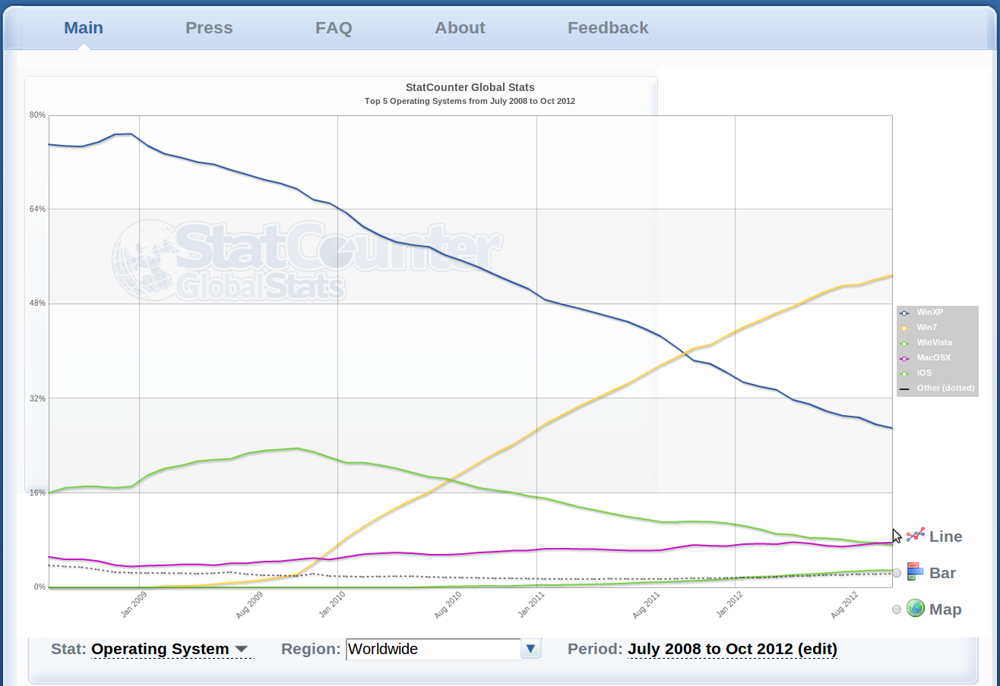

---

# Cuotas de Navegadores

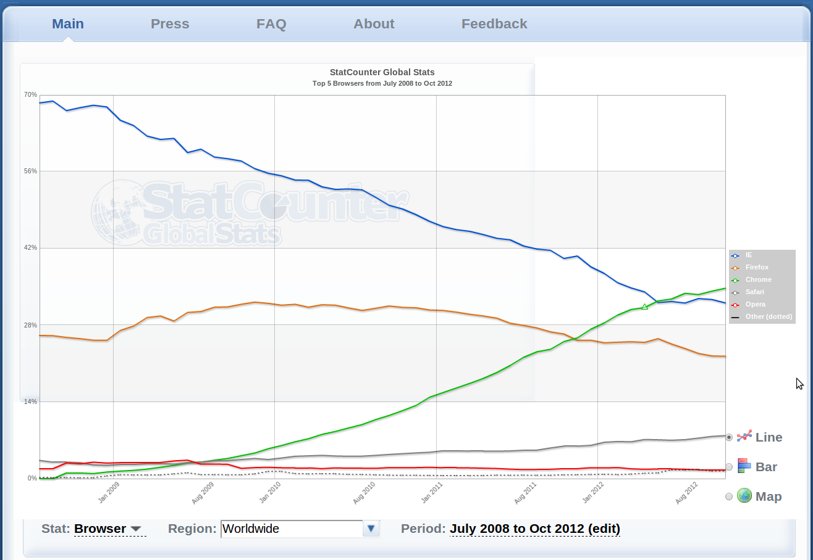

---

# ¿Quién usa Software Libre?

---

# Tuenti

- Millones de usuarios al día
- 72 minutos/persona y día
- 20.000 millones págs. vistas/mes
- +20.000 págs./seg en pico
- 2'5 millones de fotos nuevas/día
- 2.500 millones de fotos servidas/día

Fuente: Tuenti, 2009

---

# Opensource no es sólo software

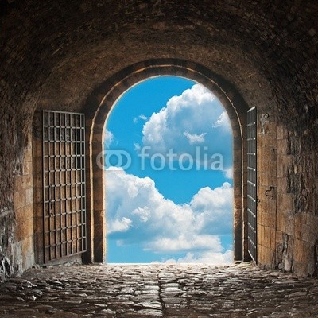

---

# Opensource no es sólo software

- Open Hardware
	- **Arduino**
	- **Raspberry Pi**
- GVCS: Maquinaria Open Source
- Open Energy Monitor
- **y cada vez más!!**

---

# Arduino

<iframe width="100%" height="80%" src="http://www.youtube.com/embed/UoBUXOOdLXY" frameborder="0" allowfullscreen></iframe>

---

# Raspberry Pi

- Computador del tamaño de una tarjeta de crédito
- Hojas de cálculo, procesadores de texto, juegos, Video de alta definición, etc.
- Ideal para aprender a programar (niños especialmente)
- **$25 o $35**

	

		
	

	

		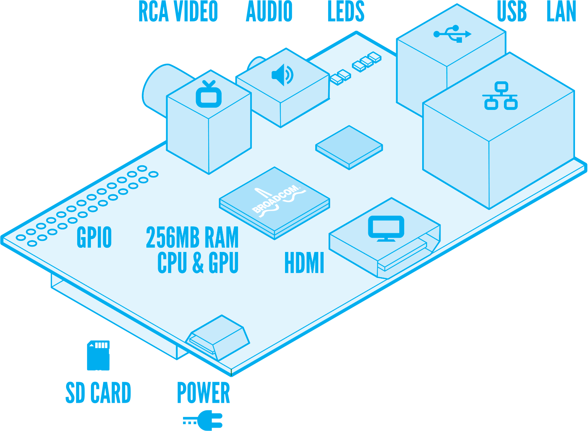
	

---

# Global Village Construction Set

<iframe width="100%" height="80%" src="http://opensourceecology.org/gvcs.php" frameborder="0" allowfullscreen></iframe>

---

# Global Village Construction Set

<iframe width="100%" height="80%"src="http://www.youtube.com/embed/CD1EWGQDUTQ" frameborder="0" allowfullscreen></iframe>

---

# Open Energy Monitor

- Herramientas de **monitorización de la energía**
- Ayudarnos a mejorar nuestro **uso de la energía**, de nuestros **sistemas de energía** y el reto de una **energía sostenible**.

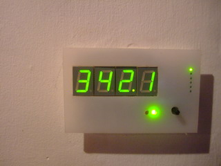 

---

# Conclusiones...

- **Escasa difusión** -> los vendendores de software privativo afianzan su posición dominante
- Los usuarios **no son personas aisladas** que consumen sistemas y aplicaciones informáticas y guardan sus trucos o recetas en casa.
	- Argumentaciones de abogados
	- Recetas de cocina
- El enfoque del Software de Libre nos lleva a trabajar todos juntos en un **intercambio permanente, legal y libre** de las mejoras.
- Todo el mundo se aprovecha de las mejoras, **¡incluso quienes fabrican el software!**

---

# ... más conclusiones

- Es un **principio global**, la unión hace la fuerza: si los usuarios pueden leer, modificar y redistribuir el código fuente de un programa, éste va a evolucionar, va a desarrollarse y va a mejorar a una velocidad vertiginosa.
- Los códigos públicos permiten adaptarnos a ellos, **sin dependencias** de grandes empresas que en algún momento dado puedan modificarlos y/o retirarlos del mercado, dejándonos **fuera de juego**.

---

# ... ya termino!

- El Sofware Libre está ahí a nuestro alcance:
	- Coches
	- Electrodomésticos
	- Aviación
	- Radares

---

# Enlaces de interés

- Cenatic
	- http://www.cenatic.es/publicaciones/divulgativas
- Catálogo de Software Libre Educativo
	- http://www.cidetys.org.pa/images/files/Catalogo%20Software.pdf
- Cursos
	- http://formados.bilib.es/

---

# ¿Preguntas, Dudas, Sugerencias?

---

# ¡¡Muchas Gracias!!

---

# Imágenes

		- Red global verde: http://es.fotolia.com/id/28659625
		- Sostenibilidad Económica: http://www.nextel.es/wp-content/uploads/rse_economica-300x200.jpg
		- Cerditos: http://es.fotolia.com/id/39682380
		- Colaboración: http://es.fotolia.com/id/37122502
		- Entorno local: http://es.fotolia.com/id/35289929
		- Manos: http://es.fotolia.com/id/40320218
		- Hormigonera: http://es.fotolia.com/id/40517520
		- Huella ecológica: http://es.fotolia.com/id/14429480
		- Interrogantes: http://es.fotolia.com/id/37148107
		- CD's: http://es.fotolia.com/id/20037990
		- Business Ethics: http://es.fotolia.com/id/41066691
		- Open Energy Monitor: http://www.embedds.com/wp-content/uploads/2011/02/arduino_energy_monitor.jpg
		- Puertas Abiertas: http://es.fotolia.com/id/36773330
		. Trabajadores: http://es.fotolia.com/id/44361348
		- Monos: http://es.fotolia.com/id/41900262
		- Question: http://es.fotolia.com/id/32018424